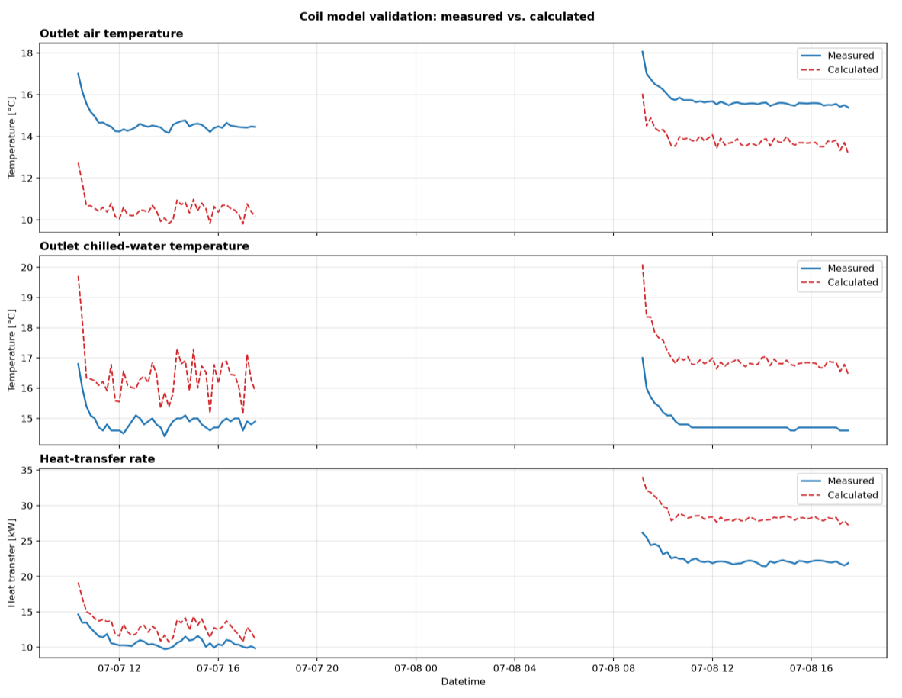
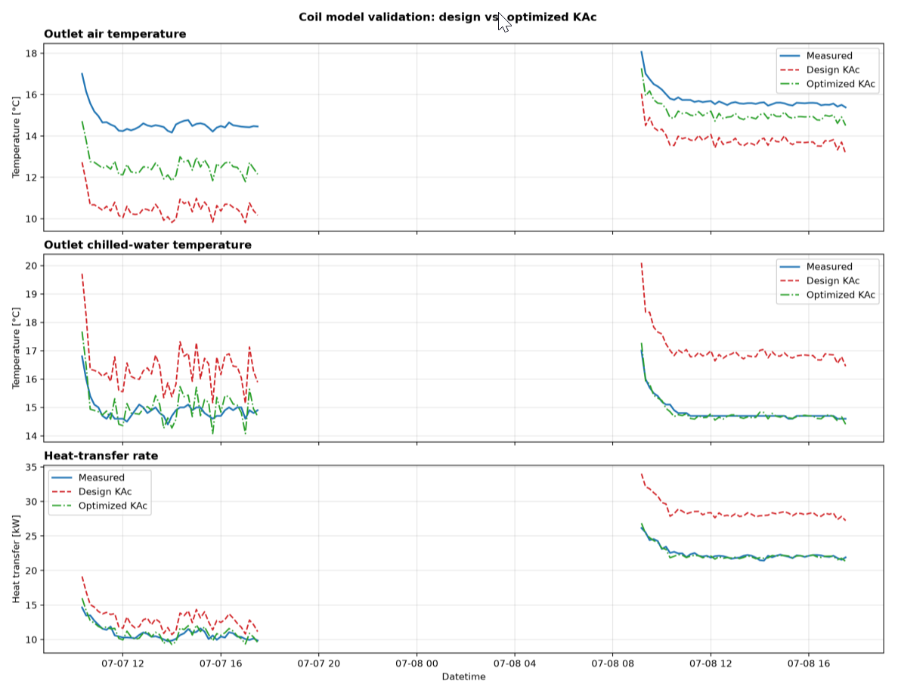

# コイル濡れ面係数モデル

## 1.  基本情報

| 項目 | 内容 |
|---|---|
| 名称 | 冷温水コイルモデル（濡れ面係数） |
| 概要 | 本モデルは、入口空気温湿度、入口水温、風量および流量から、冷温水コイルの出口空気温湿度、出口水温、交換熱量を定常状態で算出するモデルである。風量比および水量比で熱通過能力（KA）を補正し、冷却時に出口空気の相対湿度が乾湿境界を超える場合は、顕熱比に応じた濡れ面係数を用いて除湿を含む熱交換を計算する。 |
| カテゴリ | 設備 - 空調 - 空調機 - 冷温水コイル |
| 参考文献 | 新晃工業技術資料、coil_wsf_model.m |

## 2.  入出力インターフェイス

### 2.1 入力項目

| 変数名 | 単位 | データ型 | 定義 |
|:--:|----|----|----|
| $T_{ai}$ | ℃DB | 数値(Real) | 入口空気乾球温度 |
| $X_{ai}$ | kg/kgDA | 数値(Real) | 入口空気絶対湿度 |
| $V$ | kgDA/s | 数値(Real) | 空気側質量流量 |
| $T_{wi}$ | ℃ | 数値(Real) | 入口水温 |
| $M$ | kg/s | 数値(Real) | 水側質量流量 |

### 2.2 出力項目

| 変数名 | 単位 | データ型 | 定義 |
|:--:|----|----|----|
| $T_{ao}$ | ℃DB | 数値(Real) | 出口空気乾球温度 |
| $X_{ao}$ | kg/kgDA | 数値(Real) | 出口空気絶対湿度 |
| $T_{wo}$ | ℃ | 数値(Real) | 出口水温 |
| $Q_t$ | kW | 数値(Real) | 空気側の処理熱量。冷却時（除去熱量）は正の値、加熱時は負の値とする。|
| $Q_s$ | kW | 数値(Real) | 空気側の顕熱処理熱量。冷却時（除去熱量）は正の値、加熱時は負の値とする。|
| $Q_l$ | kW | 数値(Real) | 空気側の潜熱処理熱量。冷却時（除去熱量）は正の値、加熱時は負の値とする。|
| $SHF$ | \- | 数値(Real) | 顕熱比 |
| $WSF$ | \- | 数値(Real) | 濡れ面係数。乾きコイル時は1となる。 |
| $KA$ | kW/K | 数値(Real) | 風量・水量補正後の熱通過能力 |

> **確認事項：顕熱比、濡れ面係数、補正後の熱通過能力の出力は必要でしょうか**

### 2.3 パラメータ

| 変数名 | 単位 | データ型 | 定義 |
|:--:|----|----|----|
| $V_d$ | kg/s | 数値(Real) | 定格時の空気側質量流量 |
| $M_{cd}$ | kg/s | 数値(Real) | 定格時の冷却時水側質量流量 |
| $M_{hd}$ | kg/s | 数値(Real) | 定格時の加熱時水側質量流量 |
| $KA_{cd}$ | kW/K | 数値(Real) | 定格時の冷却時熱通過能力 |
| $KA_{hd}$ | kW/K | 数値(Real) | 定格時の加熱時熱通過能力 |

### 2.4 内部定数

| 変数名 | 値 | 単位 | 定義 |
|:--:|----|----|----|
| $c_a$ | 1.006 | kJ/(kg·K) | 空気の比熱 |
| $c_w$ | 4.186 | kJ/(kg·K) | 水の比熱 |
| $e_l$ | 2501 | kJ/kg | 水の蒸発潜熱 |
| $RH_{bd}$ | 95 | % | 乾湿境界相対湿度 |
| $SHF_{min}$ | 0.38 | \- | 濡れ面係数の算定に用いる顕熱比の下限 |
| $p_{KA}$ | $[-0.18409, 0.74509, 0.92825, -0.010664, 3.2112, 0.0027578]$ | \- | 水量比・風量比によるKA補正係数 |
| $p_{WSF}$ | $[1.0972, -2.7088, 2.6121]$ | \- | 濡れ面係数の2次近似係数 |

> **確認事項：濡れ面係数の近似式は変数ではなく直書きされているがよいか**

## 3.  計算ロジック

### 3.1 風量・流量による判定

$M > 0$ かつ $V > 0$である場合は、3.2以降の処理に進む。

$M \leq 0$ もしくは $V \leq 0$である場合は、以下の通りとして、処理を終了する。

``` math
SHF = WSF = KA  = 0 \\
T_{ao} = T_{ai}  \\
X_{ao} = X_{ai} \\
T_{wo} = T_{wi} \\
Q_t = Q_s = Q_l = 0  \\
```


### 3.2 冷却・加熱モードの判定

入口空気乾球温度と入口水温の比較により冷却モードか加熱モードかを判定し、定格水量 $M_{d}$および定格熱通過能力$KA_{d}$を決定する。

``` math
\begin{cases}
T_{ai} > T_{wi}: & \text{冷却モード},\quad M_d=M_{cd},\quad KA_d=KA_{cd} \\
T_{ai} \leq T_{wi}: & \text{加熱モード},\quad M_d=M_{hd},\quad KA_d=KA_{hd}
\end{cases}
```

> **確認事項：$T_{ai} = T_{wi}$の場合は加熱モードでよいのか。適切に計算できるか。**

### 3.3 熱通過能力の補正

水量比および風量比を次式で算出する。

``` math
r_M = \frac{M}{M_d}
```

``` math
r_V = \frac{V}{V_d}
```

補正係数$r_{KA}$および補正後の熱通過能力$KA$は次式で算出する。

``` math
A_M = p_1 r_M^2 + p_2 r_M + p_3
```

``` math
A_V = p_4 r_V^2 + p_5 r_V + p_6
```

``` math
r_{KA} = \frac{1}{\dfrac{1}{A_M}+\dfrac{1}{A_V}}
```

``` math
KA = KA_d\,r_{KA}
```

> **確認事項：$A_{M}$、$A_{V}$が0や負の値になることはありませんか。**
>
> 
### 3.4 乾きコイルの出口状態

補正後の熱通過能力、入口空気温湿度、入口水温、風量、流量から、内蔵された対数平均温度差法により乾きコイルとしての出口空気乾球温度 $T_{ao,dry}$ と出口水温 $T_{wo,dry}$ を算定する。

> **確認事項：内蔵された対数平均温度差法？？**

乾きコイルにおける水側熱量は次式で算出する。

``` math
Q = (T_{wo,dry}-T_{wi})M c_w
```

乾きコイル出口温度 $T_{ao,dry}$ と入口絶対湿度 $X_{ai}$ から、内蔵された湿り空気状態計算により出口相対湿度 $RH_{ao,dry}$ を算定する。

> **確認事項：内蔵された湿り空気状態計算？？**

### 3.5 乾湿状態の判定と出口状態の計算

次の条件をともに満たす場合は「濡れコイル」と判定し、1)の処理を実行する。

``` math
T_{ai} > T_{wi} (冷却モード) \\
RH_{ao,dry} > RH_{bd}
```

上記の条件を満たさない場合は「乾きコイル」と判定し、2)の処理を実行する。

#### 1) 濡れコイル

出口空気乾球温度$T$を仮定し、二分法による収束計算により出口状態を算出する。

a\) 出口空気乾球温度の探索範囲の設定

出口空気乾球温度の探索下限$T_{1}$を乾きコイルの出口空気温度、探索上限$T_{2}$を入口絶対湿度 $X_{ai}$ において相対湿度が95 %となる乾球温度とする。

``` math
T_1 = T_{ao,dry}
```

``` math
T_2 = T_{db}(RH_{bd},X_{ai})
```

> **確認事項：関数 $T_{db}$ の説明が必要。関数なので$F_{Tdb}$とすべきか**
> **確認事項：$T_{1} > T_{2}$となることはないか**
 
b\) 候補出口温度における空気側状態の算出

候補出口温度 $T$ に対して、内蔵された湿り空気状態計算により、相対湿度95 %での出口絶対湿度 $X_{ao}$ を求める。

> **確認事項：内蔵された湿り空気状態計算？？**
> **確認事項：候補出口温度の初期値は？**

``` math
X_{ao} = X(T,RH_{bd})
```

空気側の顕熱量、潜熱量、全熱量および顕熱比を求める。

``` math
Q_s = (T_{ai}-T)V c_a
```

``` math
Q_l = (X_{ai}-X_{ao})V e_l
```

``` math
Q_t = Q_s + Q_l
```

``` math
SHF = \frac{Q_s}{Q_t}
```

c\) 濡れ面係数と熱交換器能力

濡れ面係数 $WSF$ は、顕熱比$SHF$に下限$SHF_{min}$を適用したうえで、次式で求める。

``` math
SHF' = \max(SHF,SHF_{min})
```

``` math
WSF = 1.0972\,{SHF'}^2 - 2.7088\,SHF' + 2.6121
```

候補温度 $T$ に対応する出口水温$T_{wo}$、対数平均温度差$\Delta T_{lm}$および熱交換器能力$Q_{HEX}$を求める。

``` math
T_{wo} = T_{wi} + \frac{Q_t}{M c_w}
```

``` math
\Delta T_{lm} = \frac{(T_{ai}-T_{wo})-(T-T_{wi})}
{\ln\left(\dfrac{T_{ai}-T_{wo}}{T-T_{wi}}\right)}
```

``` math
Q_{HEX} = KA\,\Delta T_{lm}\,WSF
```

d\) 二分法による出口空気温度の決定

次式で定義される残差$f(T)$が0となる出口空気温度$T$を探索する。

``` math
f(T) = Q_{HEX} - Q_t
```

初期区間の両端で残差の符号が異なる場合、つまり、$f(T_{1}) * f(T_{2}) < 0$ の場合は、20回を上限として二分法を実行する。中点の残差の符号に基づき、根を含む半区間を次の探索区間とする。残差の絶対値が0.1 kW未満になった時の$T$を出口空気温度の採用値とする。

``` math
|f(T)| < 0.1
```

> **確認事項：$f(T_{1})=0$ または $f(T_{2}) = 0$の場合はどうするか。**
> **確認事項：20回で収束しなかった場合の処理を明記する必要がある**

初期区間の両端で残差の符号が同じ場合、つまり、$f(T_{1}) * f(T_{2}) > 0$ の場合は、残差の絶対値が小さい端点を採用する。

探索終了後は、採用した出口空気温度を使用して、空気側状態および水側状態を再計算して出力値を確定する。

#### 2) 乾きコイル時の出力

乾きコイルの場合は、絶対湿度は変化しないものとする。

``` math
T_{ao} = T_{ao,dry} \\
X_{ao} = X_{ai} \\
T_{wo} = T_{wo,dry} \\
Q_t = Q_s = Q \\
Q_l = 0 \\
SHF = 1 \\
WSF = 1
```

## 4.  精度検証

### 4.1 検証方法

シンガポールの鹿島建設施設内で計測した2日間の冷水コイル周りのデータを用いて検証を行なった。10分刻みのデータの各時刻についてモデル計算を行い、出口空気温度、出口水温および交換熱量を比較した。空調の立ち上がり過渡を除外するため、各運転区間の開始から30分未満は検証対象外とした。

### 4.2 検証条件

| 項目 | 設定値 |
|----|----:|
| 実測CSV総行数 | 289件 |
| 検証対象行数 | 95件 |
| 立ち上がり除外時間 | 30分 |
| 定格水量 | 40.8 L/min |
| 定格風量 | 6,560 m<sup>3</sup>/h |
| 設計 $KA_c$ | 3.367 kW/K |

### 4.3 検証結果

設計値の $KA_c$ を用いた比較結果を以下に示す。熱量は実測値より大きく算定される傾向がある。

| 比較項目 | MAE | RMSE | CVRMSE |
|----|----:|----:|----:|
| 出口空気温度 | 2.93 ℃ | 3.13 ℃ | \- |
| 出口水温 | 1.85 ℃ | 1.92 ℃ | \- |
| 交換熱量 | 4.29 kW | 4.79 kW | 28.07 % |



## 5.  パラメータ同定

定格風量 $V_d$、定格水量 $M_{cd}$は設計仕様で固定とし、$KA_{cd}$を同定する。

### 5.1 $KA_{cd}$ の同定方法

4章と同じ定常実測データ95件に対して交換熱量のRMSEを目的関数とし、$KA_{cd}$ を探索した。

``` math
RMSE_Q = \sqrt{\frac{1}{N}\sum_{i=1}^{N}\left(\left|Q_{model,i}\right|-Q_{measured,i}\right)^2}
```

探索範囲は設計 $KA_{cd}$ の20 %から300 %、探索手法は黄金分割探索、反復回数は40回とした。

### 5.2 同定結果

| 項目 | 設計値 | 同定値 |
|----|----:|----:|
| $KA_{cd}$ | 3.367 kW/K | 2.246 kW/K |
| 設計値に対する比 | 1.00 | 0.667 |
| 交換熱量RMSE | 4.79 kW | 0.44 kW |
| 出口空気温度RMSE | 3.13 ℃ | 1.52 ℃ |
| 出口水温RMSE | 1.92 ℃ | 0.29 ℃ |

熱量RMSEを最小化する目的で同定した結果、$KA_{cd}$ は設計値の約66.7 %となった。全熱ベースではよく一致しているものの、特に1日目の低負荷運転時に出口空気温度が低くなっており、顕熱・潜熱の内訳の誤差が大きくなる傾向がある。この点を解消するためには $p_{KA}$ や $p_{WSF}$ の同定を検討する必要がある。



## 6.  Cxにおける使用場面の想定

